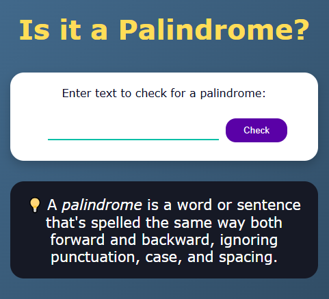
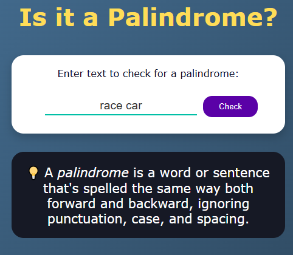
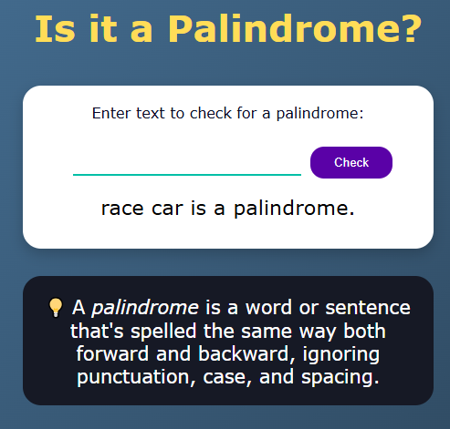
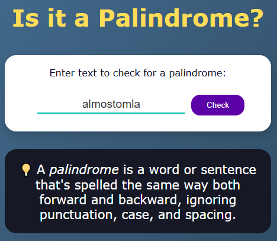
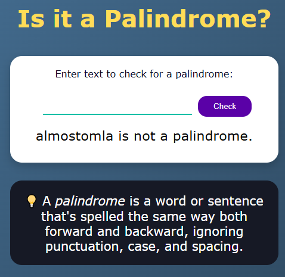
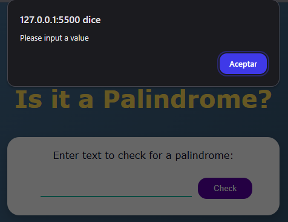

# 🔎 Proyecto: Verificador de Palíndromos

Este repositorio contiene el código fuente de un **Verificador de Palíndromos**, uno de los proyectos necesarios para completar la certificación **Algoritmos y Estructuras de Datos de JavaScript de freeCodeCamp**. Es una aplicación web simple construida con HTML, CSS y JavaScript, diseñada para verificar si una palabra o frase ingresada por el usuario es un palíndromo, procesando el texto adecuadamente.

## ✨ Características Destacadas

- **Verificación Precisa:** Determina si una cadena es un palíndromo basándose en las reglas establecidas (ignora caracteres no alfanuméricos y diferencias de mayúsculas/minúsculas).
- **Interfaz Intuitiva:** Proporciona un campo de entrada y un botón para la interacción del usuario.
- **Feedback Inmediato:** Muestra el resultado de la verificación directamente en la página.
- **Manejo de Errores Simples:** Alerta al usuario si intenta realizar una verificación con el campo vacío.

## 🛠️ Tecnologías Utilizadas

- **HTML5:** Define la estructura y los elementos de la página web.
- **CSS3:** Controla la presentación visual y el diseño de la interfaz.
- **JavaScript:** Implementa la lógica central para la verificación del palíndromo y maneja la interacción del usuario (eventos del botón y teclado).

## 🚀 Uso

Para probar la aplicación localmente, sigue estos pasos:

1.  **Clona el repositorio:**
    ```bash
    git clone https://github.com/josecervera20/palindrome-checker.git
    ```
2.  **Accede al directorio del proyecto:**
    ```bash
    cd palindrome-checker
    ```
3.  **Abre `index.html`:**
    Localiza el archivo `index.html` en la carpeta del proyecto y ábrelo con tu navegador web preferido.

---

## Demostraciones Visuales

Aquí se muestra cómo interactuar con la aplicación en diferentes escenarios:

- **Estado Inicial de la Interfaz:**
  
  La apariencia de la aplicación al cargarla en el navegador.

- **Verificando un Palíndromo:**
  
  Proceso de ingresar un texto que es palíndromo y ejecutar la verificación.

  _Resultado esperado:_
  
  Mensaje mostrado cuando el texto ingresado es un palíndromo.

- **Verificando un Texto NO Palíndromo:**
  
  Proceso de ingresar un texto que no es palíndromo y ejecutar la verificación.

  _Resultado esperado:_
  
  Mensaje mostrado cuando el texto ingresado NO es un palíndromo.

- **Manejo de Entrada Vacía:**
  
  Acción de intentar verificar sin ingresar texto.

  _Resultado esperado:_
  Una alerta en el navegador con el texto "Please input a value".

## ✅ Estado del Proyecto

**Completado.**

Este repositorio representa el resultado final de **uno de los proyectos que forman parte de la certificación Algoritmos y Estructuras de Datos de JavaScript** de freeCodeCamp, construido con **HTML, CSS y JavaScript**.

---

👋 ¡Siéntete libre de explorar el código!
